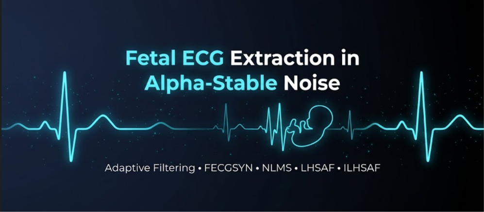

<p align="center">
  
</p>

# Fetal ECG Extraction in Alpha-Stable Noise

Implementation and reproduction of adaptive filtering algorithms for **fetal ECG (FECG) extraction** under **impulsive alpha-stable noise**, based on two published research papers.

## Papers Reproduced

- **Improved Least Lncosh Based Fetal Electrocardiography Extraction in Alpha-Stable Noise**
- **Extraction of Fetal ECG by Logarithmic Hyperbolic Secant Adaptive Algorithm in Alpha-Stable Noise**

## Project Overview

This project reproduces and evaluates adaptive filtering techniques for extracting fetal ECG signals from maternal abdominal ECG recordings using the **FECGSYN simulated database**.

The implementation covers the complete processing pipeline, including synthetic alpha-stable noise generation, automatic reference channel selection, adaptive filtering, and performance evaluation.

## Features

- Alpha-stable noise generation
- Automatic reference channel selection
- Multiple adaptive filtering algorithms
- Performance evaluation using standard signal quality metrics
- Reproducible experimental pipeline

## Processing Pipeline

```text
FECGSYN Database
        │
        ▼
Reference Channel Selection
        │
        ▼
Alpha-Stable Noise Generation (GSNR = 15 dB)
        │
        ▼
Adaptive Filtering
        │
        ▼
Extracted Fetal ECG
        │
        ▼
Performance Evaluation
```

## Implemented Algorithms

### Paper 1 Algorithms

- NLMS (Normalized Least Mean Square)
- IPNLMS (Improved Proportionate NLMS)
- ILL (Improved Least Lncosh)

### Paper 2 Algorithms

- Llncosh
- LHSAF (Logarithmic Hyperbolic Secant Adaptive Filter)
- ILHSAF (Improved LHSAF)

## Evaluation Metrics

The algorithms are evaluated using the following metrics:

| Metric | Purpose |
|--------|---------|
| **RMSE** | Reconstruction error |
| **PRD** | Percentage root-mean-square distortion |
| **SNR** | Signal quality |
| **AMSE** | Convergence performance |

## Dataset

This project uses the **FECGSYN simulated database**, which provides realistic maternal and fetal ECG signals for benchmarking adaptive filtering methods.

## Future Work

- Evaluate on real PhysioNet fetal ECG datasets
- Multi-reference adaptive filtering
- Deep learning–based hybrid FECG extraction methods
- Extended benchmarking across different noise conditions

## License

This project is intended for research and educational purposes.